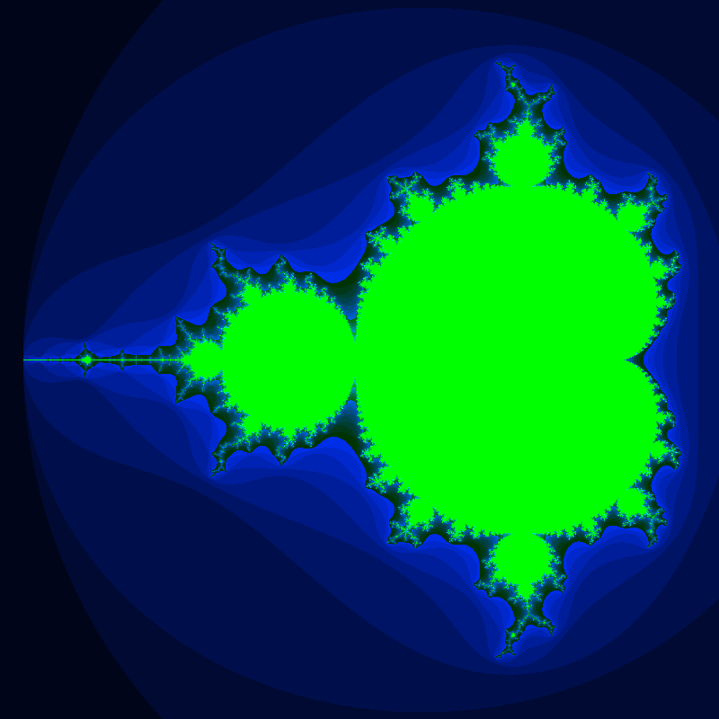
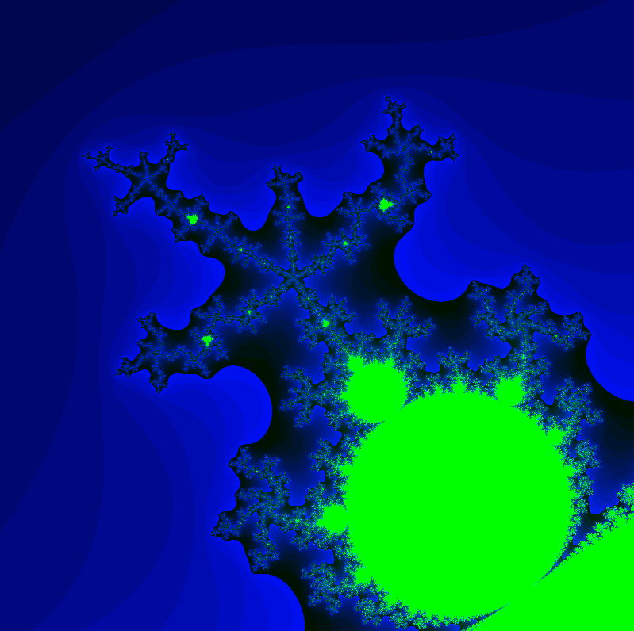
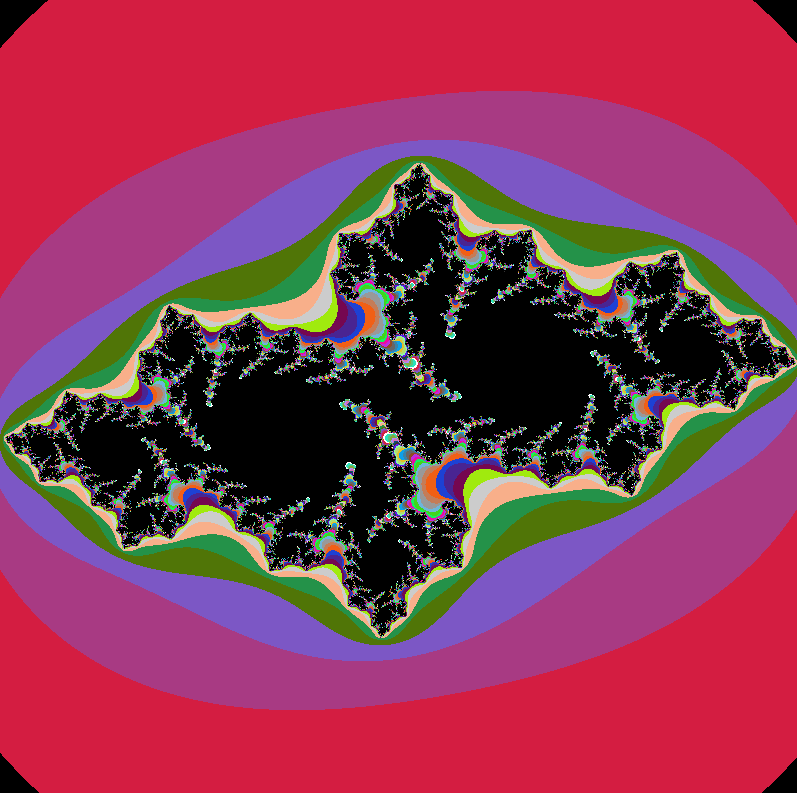
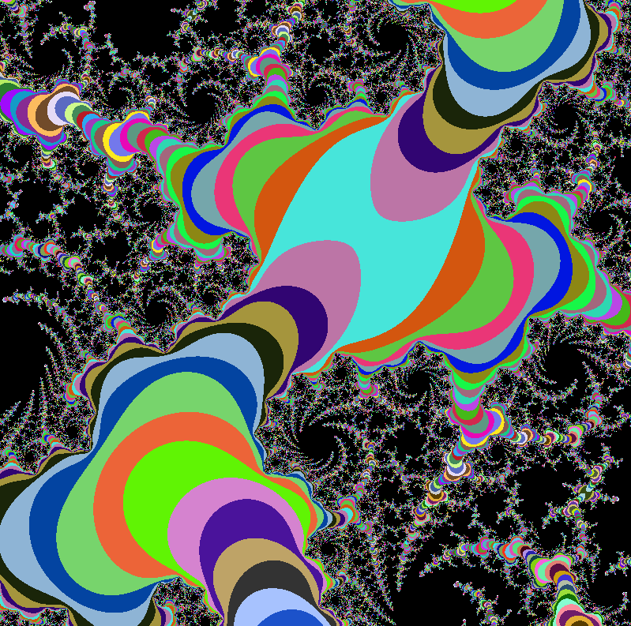

# Fractol - Campus42

## Description

This project is about simulating and visualizing mathematical fractals, including the **Mandelbrot set**, the **Julia set** and the **Newton fractal**. Developed in C, the program uses the **MiniLibX** graphical library, an internal tool created at Campus 42 to help students better understand graphical programming and event handling in graphical environments.

## Features
 - Renders complex fractals with an interactive graphical interface.
 - Allows exploration and zooming into specific areas of the fractals.
 - Implements controls to adjust parameters and visualize variations.

## Screenshots
Below are some snapshots of the fractal rendering process:
<table>
<tr>
<td></td>
<td></td>
</tr>
<tr>
<td></td>
<td></td>
</tr>
<tr>
<td></td>
<td></td>
</tr>
</table>

## Requirements

- **Make**: Used to compile the project.
- **gcc**: C compiler.
- **MiniLibX**: Graphics library used to render the fractals.

## Instalation

1. Clone the repository:
	```sh
	git clone https://github.com/tu_usuario/fractol.git
	cd fractol
3. Compile the Minilibx:
	```sh
	cd include/minilibx-linux
	make
2. Compile the project and run it:
	```sh
	cd ../../
	make
	./fractol

## Controls

 - **Flechas and w/a/s/d**: Move the view.
 - **'m' and 'n'**:  Increase and decrease sharpness.
 - **c**: Change colors.
 - **'+' y '-' or scroll**:  Zoom in and out.