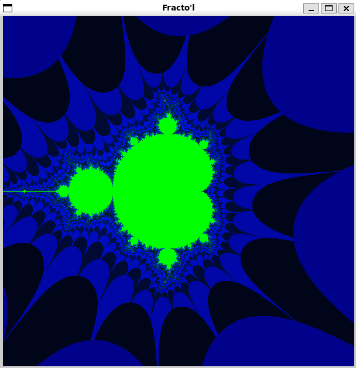
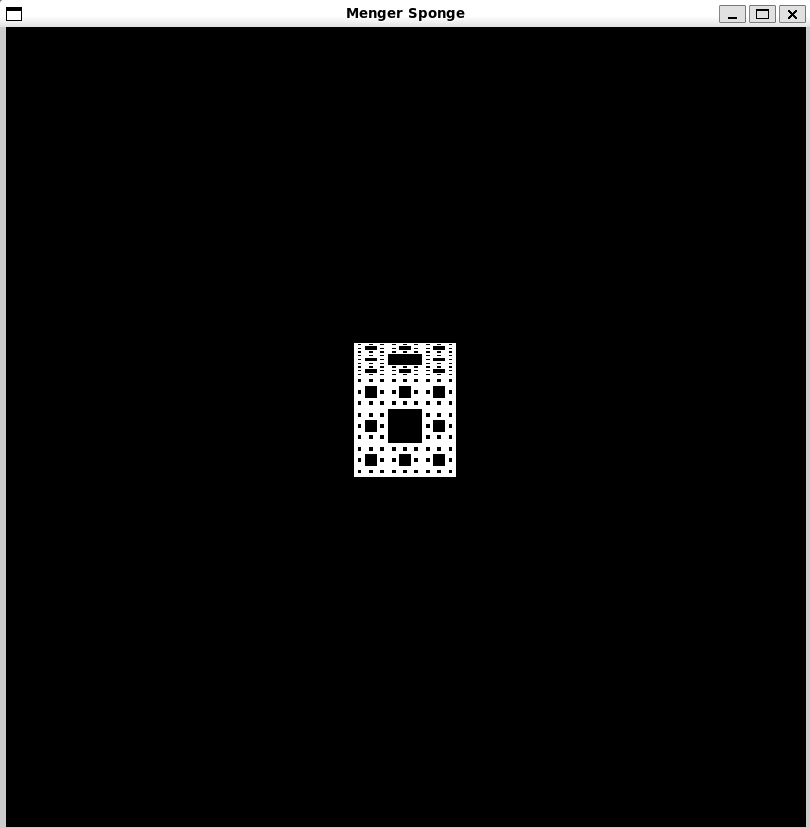

# Fractol - Campus42

## Descripción

Este proyecto consiste en la simulación y visualización de fractales matemáticos, incluyendo el **conjunto de Mandelbrot** y el **conjunto de Julia**. Desarrollado en C, el programa utiliza la biblioteca gráfica **MiniLibX**, una herramienta creada internamente en el campus 42 para ayudar a los estudiantes a comprender mejor la programación gráfica y el manejo de eventos en entornos gráficos.

## Características
 - Renderiza fractales complejos con una interfaz gráfica interactiva.
 - Permite la exploración y el zoom en áreas específicas de los
 fractales.
 - Implementa controles para ajustar parámetros y visualizar variaciones.

## Capturas de pantalla

 - **Primer planteamiento del conjunto de Mandelbrot:**

	

 - **Intento fallido de Esponja de Menger en 3d:**

	

## Requisitos

- **MiniLibX**: Debe estar instalada y correctamente configurada en tu sistema.
- **Make**: Utilizado para compilar el proyecto.
